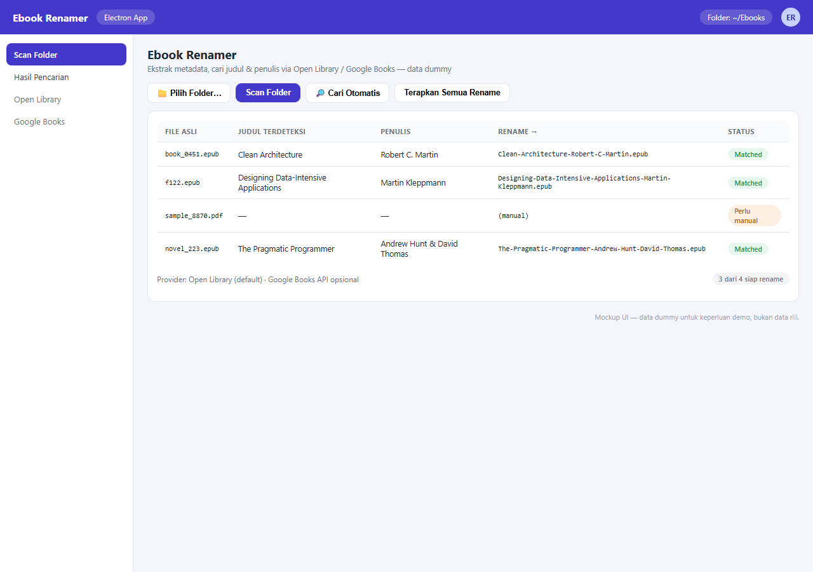

# Ebook Renamer

[](https://github.com/adityarahmanananda-dev/ebook-renamer-electron/actions/workflows/ci.yml)

A desktop **Electron** app that scans folders of `.epub` / `.pdf` files, extracts title and author metadata, finds the best match via **Open Library** and **Google Books**, and renames files to `[Title]-[Author]`.

## Screenshot



> Screenshot is a UI mockup with dummy data — not real data.

## Usage

```bash
npm install      # once, first time
npm start        # afterwards
```

`npm start` automatically installs client dependencies if missing, builds the React client if needed, then opens the app window.

In the app:
1. Click **📁 Choose Folder…** to select a folder via the native dialog (no manual path typing).
2. Click **Scan Folder**.
3. Click **Search automatically** per file (or fill in title/author manually).
4. Click **Apply All Renames**.

## Optional: Google Books API key

For more stable search results:

```bash
GOOGLE_BOOKS_API_KEY=xxx npm start
```

Without a key, Open Library is used as fallback. Each provider has its own timeout so it never hangs.

## Project structure

```
electron/        main process + preload (native folder dialog via IPC)
server/src/      Express backend (scan, metadata extraction, search, rename)
client/          React frontend (Vite)
launch.mjs       launcher: auto-install + build + run Electron
```

## Packaging (installer)

```bash
npm run dist     # output in release/ (AppImage / deb)
```

`release/` is a build artifact and is not committed.